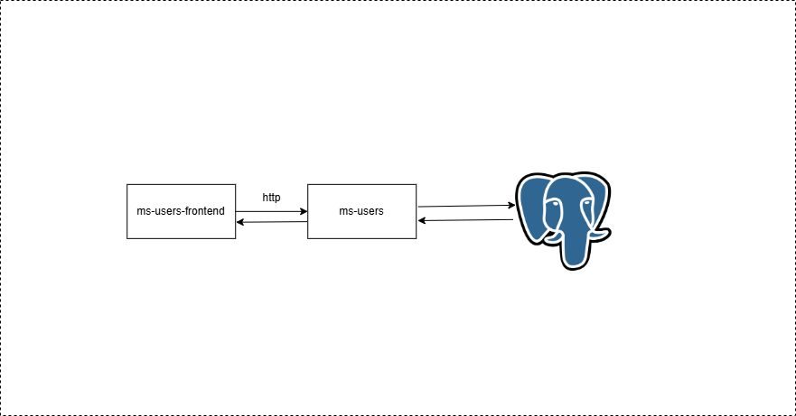

# MS-BSS-BUYFLOW


## Description
Microservice responsible for managing the user CRUD.



## Tech Stack
1. [NodeJS 20+](https://nodejs.org/dist/latest-v20.x/docs/api/)
2. [Express](https://expressjs.com/)
3. [PostgreSQL](https://www.postgresql.org/)
4. [Docker](https://www.docker.com/)

## Routes
* User
  * POST /users
  * DELETE /users/{userId}
  * PUT/users
  * GET /users/{userId}
  * GET /users

## Local Variables
See [.env.sample](.env.sample) file

## Running Application with Docker 🐳 

```bash
# Run both the application and PostgreSQL using Docker Compose
docker compose up --build

# After building the application
docker compose up -d
```

## Running Application Locally

Install dependencies

```shell
npm i
```

Create the PostgreSQL databse instance using Docker, remember to put the username and password in both the command and .env

```shell
docker run --name postgres-db -e POSTGRES_USER={YOUR USERNAME} -e POSTGRES_PASSWORD={YOUR_PASSWORD} -e POSTGRES_DB=user -p 5432:5432 -d postgres
```

Start the application

```shell
npm run start
```

Once the application starts, you can now call the routes. 

curl for example:

```shell
curl --location 'localhost:3001/msusers/users/10'
```